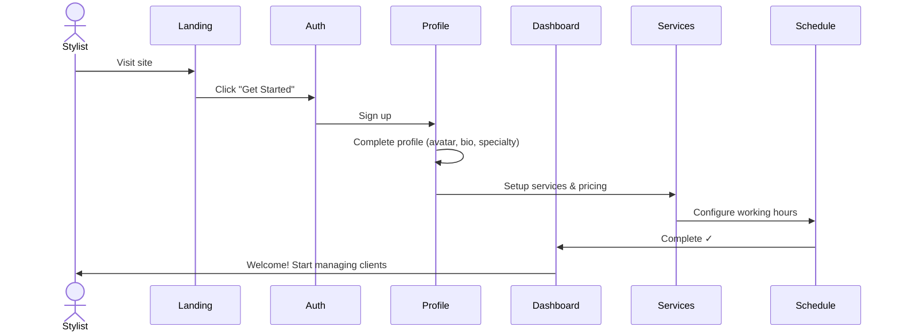
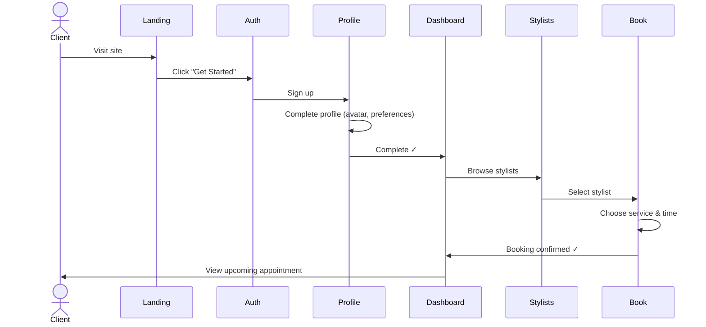
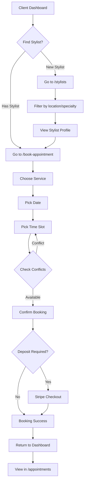
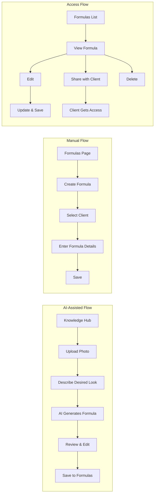
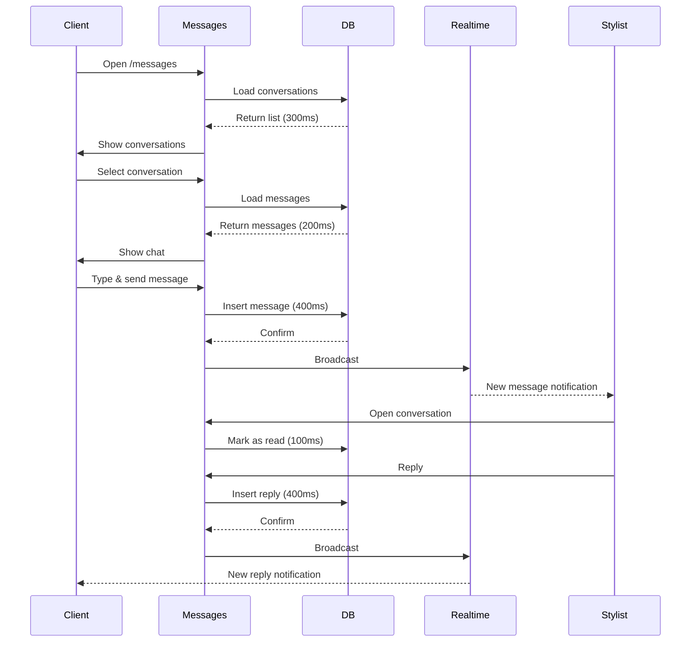
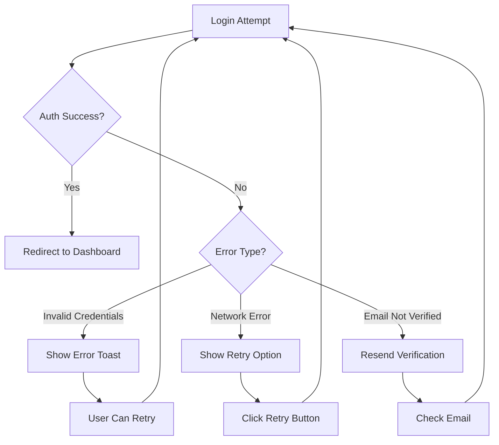
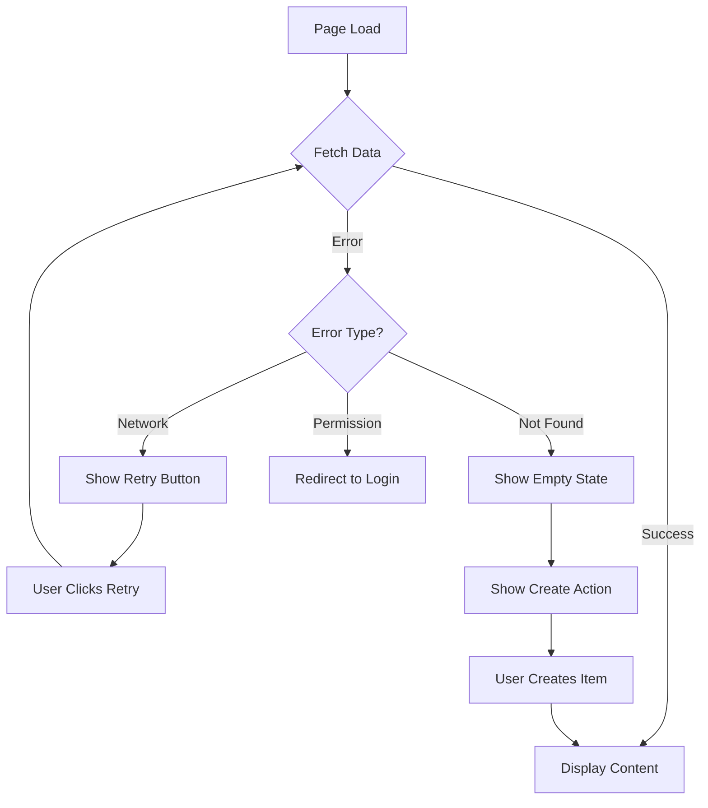

# Flow Graph - Navigation & User Journey Map

## System Architecture

```mermaid
graph TB
    subgraph "Public Layer"
        Landing[Landing Page /]
        Auth[Auth Page /auth]
    end
    
    subgraph "Protected Layer"
        Dashboard[Dashboard /dashboard]
        
        subgraph "Shared Routes"
            Messages[Messages /messages]
            Settings[Settings /settings]
            Appointments[Appointments /appointments]
            Formulas[Formulas /formulas]
            Knowledge[Knowledge /knowledge]
            Resources[Resources /resources]
            Integrations[Integrations /integrations]
        end
        
        subgraph "Stylist-Only Routes"
            ClientDiscovery[Client Discovery /client-discovery]
            Finance[Finance /finance]
            Schedule[Schedule /schedule]
            Portfolio[Portfolio /portfolio]
            Clients[Clients /clients]
            Services[Services /services]
            AccessCodes[Access Codes /access-codes]
        end
        
        subgraph "Client-Only Routes"
            ClientRequests[Client Requests /client-requests]
            BookAppointment[Book Appointment /book-appointment]
            StylistDiscovery[Find Stylists /stylists]
            StylistProfile[Stylist Profile /stylist]
        end
    end
    
    Landing --> Auth
    Auth --> Dashboard
    Dashboard --> Messages
    Dashboard --> Settings
    Dashboard --> Appointments
    Dashboard --> Formulas
    Dashboard --> Knowledge
    Dashboard --> Resources
    Dashboard --> Integrations
    
    Dashboard --> ClientDiscovery
    Dashboard --> Finance
    Dashboard --> Schedule
    Dashboard --> Portfolio
    Dashboard --> Clients
    Dashboard --> Services
    Dashboard --> AccessCodes
    
    Dashboard --> ClientRequests
    Dashboard --> BookAppointment
    Dashboard --> StylistDiscovery
    StylistDiscovery --> StylistProfile
    StylistProfile --> BookAppointment
```



---

## Critical User Flows

### 1. First-Time Stylist Onboarding



**Latency Profile**:
- Landing → Auth: <100ms (navigation)
- Sign up → Profile dialog: ~500ms (auth)
- Profile completion: ~800ms (upload + save)
- Services setup: ~600ms (save)
- Schedule setup: ~700ms (save)
- **Total onboarding time**: ~3 minutes (user-paced)

---

### 2. First-Time Client Onboarding



**Latency Profile**:
- Landing → Auth: <100ms
- Sign up → Profile: ~500ms
- Profile completion: ~800ms
- Browse stylists: ~400ms (query)
- Select & book: ~1.2s (conflict check + save)
- **Total booking time**: ~5 minutes (user-paced)

---

### 3. Appointment Booking (Returning Client)



**Latency Profile**:
- Dashboard → Booking page: <100ms
- Service selection: instant (UI only)
- Date picker: instant
- Time slot query: ~300ms (check availability)
- Conflict check: ~200ms (DB query)
- Booking save: ~600ms (insert + notifications)
- Payment flow: ~2-3s (Stripe redirect)
- **Total flow**: 2-4 minutes

**Friction Points**:
- ⚠️ Time slot conflicts (requires re-selection)
- ⚠️ Payment redirect (external flow)

---

### 4. Stylist Appointment Management

```mermaid
stateDiagram-v2
    [*] --> Dashboard
    Dashboard --> Appointments: View Schedule
    
    state Appointments {
        [*] --> CalendarView
        CalendarView --> ListView: Toggle View
        ListView --> CalendarView: Toggle View
        
        CalendarView --> Details: Click Appointment
        ListView --> Details: Click Appointment
        
        Details --> Reschedule: Reschedule
        Details --> Cancel: Cancel
        Details --> MarkComplete: Complete
        
        Reschedule --> SelectNewTime
        SelectNewTime --> Conflicts{Check}
        Conflicts --> NotifyClient: Send SMS
        Conflicts --> Reschedule: Try Again
        
        Cancel --> Reason: Add Reason
        Reason --> NotifyClient
        
        MarkComplete --> AddNotes: Optional Notes
        AddNotes --> SaveRecord
    }
    
    Appointments --> Dashboard: Back
    Dashboard --> [*]
```

**Latency Profile**:
- View appointments: ~400ms (query + format)
- Reschedule check: ~200ms (availability)
- Cancel: ~500ms (update + notifications)
- Mark complete: ~600ms (update + trigger review request)

---

### 5. Formula Creation & Management



**Latency Profile**:
- AI generation: ~5-15s (depends on AI model)
- Manual save: ~600ms
- List formulas: ~300ms
- View/edit: instant (cached)

---

### 6. Messaging Flow



**Latency Profile**:
- Load conversations: ~300ms
- Load messages: ~200ms
- Send message: ~400ms (with optimistic update: instant UI)
- Realtime notification: <500ms

---

## Navigation Patterns

### Sidebar Navigation (Stylist)
```
Dashboard
├── Client Discovery
├── Clients
│   └── [Client Profile]
│       ├── Appointments
│       ├── Formulas
│       └── Notes
├── Appointments
│   └── [Appointment Details]
│       ├── Reschedule
│       ├── Cancel
│       └── Complete
├── Schedule
│   ├── Weekly Hours
│   ├── Blocked Dates
│   └── Overrides
├── Formulas
│   └── [Formula Details]
│       ├── Edit
│       └── Share
├── Portfolio
│   └── Upload Photos
├── Services
│   └── [Service Details]
│       └── Edit
├── Finance
│   └── Payments History
├── Messages
│   └── [Conversation]
└── Settings
    ├── Profile
    ├── Account
    └── Notifications
```

### Mobile Bottom Navigation
```
[Home] [Calendar] [Clients] [Messages] [Profile]
  ↓        ↓         ↓          ↓         ↓
Dashboard  Appts   Clients   Messages  Settings
```

---

## Error States & Recovery

### Authentication Errors


### Data Load Errors


---

## Performance Bottlenecks (Identified)

### 1. Dashboard Initial Load
**Current**: 
- Loads all widgets sequentially
- ~2.5s total load time

**Optimization**:
- Lazy load below-fold widgets
- Skeleton screens for each section
- Target: <1.5s perceived load

### 2. Appointments Calendar View
**Current**:
- Queries all appointments for month
- ~800ms load time

**Optimization**:
- Cache previous month data
- Prefetch adjacent months
- Target: <400ms

### 3. Stylist Discovery Search
**Current**:
- Full-text search on every keystroke
- No caching

**Optimization**:
- Implement debouncing (300ms) ✅
- Cache search results (5 min TTL)
- Target: <200ms per search

---

## Flow Friction Scores (0-100, higher = less friction)

| Flow | Score | Primary Friction Points |
|------|-------|------------------------|
| First-time stylist signup | 85 | Multi-step profile completion |
| First-time client signup | 92 | Minimal required info |
| Appointment booking (client) | 78 | Time slot conflicts, payment redirect |
| Appointment management (stylist) | 88 | Reschedule requires multiple steps |
| Formula creation (AI) | 70 | AI response time (5-15s) |
| Formula creation (manual) | 90 | Fast and direct |
| Messaging | 95 | Excellent - realtime, simple |
| Schedule management | 82 | Complex UI for overrides |

**Average Flow Score**: 85/100 (Grade B+)

**Target**: 90+/100 (Grade A)

---

## Recommended Flow Improvements

### 1. Appointment Booking - Reduce Steps
**Current**: 5 clicks + 2 forms  
**Proposed**: 3 clicks + 1 combined form

### 2. Formula AI - Improve Perceived Speed
**Current**: 5-15s wait with spinner  
**Proposed**: Progressive disclosure (show partial results as they generate)

### 3. Schedule Management - Simplify Overrides
**Current**: Separate override modal  
**Proposed**: Inline editing with context menu

---

## Exit Point Analysis

All pages have proper exit paths:
- ✅ Back buttons (30+ pages)
- ✅ Sidebar always accessible (desktop)
- ✅ Mobile nav always visible (mobile)
- ✅ Cancel buttons on all forms
- ✅ Close buttons on all dialogs

**Dead End Risk**: 0%

---

## Summary

### Navigation Integrity: ✅ EXCELLENT
- All routes protected appropriately
- No circular routes
- No dead ends
- Consistent back navigation

### Flow Efficiency: 🟡 GOOD (85/100)
- Critical flows work smoothly
- Some optimization opportunities exist
- User feedback is consistent

### Error Recovery: ✅ EXCELLENT
- All errors handled gracefully
- Retry options provided
- Clear error messages

### Performance: 🟡 GOOD
- Most interactions <500ms
- Some optimization needed (dashboard, search)
- Realtime features perform well

**Overall Flow Health**: A- (88/100)
