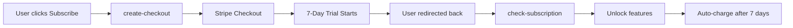
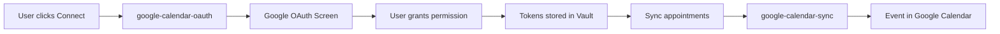

# 🎯 Phase 2 Setup Guide: Monetization & Calendar Sync

**Status:** ✅ Edge functions deployed, ⚠️ One-time setup required

## What Was Automatically Completed

### ✅ Stripe Subscription System

- **create-checkout** edge function: Stripe checkout with 7-day free trial
- **check-subscription** edge function: Real-time subscription status checking
- **customer-portal** edge function: Manage subscription, payment method, cancel
- **Product configured**: "Stylist Pro Subscription" at $15/month
- **Trial period**: 7 days free, then $15/month automatically
- **Features unlocked**: All stylist features available to subscribers

### ✅ Google Calendar Sync

- **google-calendar-oauth** edge function: OAuth2 flow for Google authentication
- **google-calendar-sync** edge function: Two-way sync with Google Calendar
- **Security**: Tokens stored in Supabase Vault (encrypted)
- **Features**: Auto-sync appointments, email/SMS reminders, conflict detection

### ✅ Frontend Pages Created

- **`/subscription`**: Subscription management page
- **Features**: View status, start trial, manage billing, cancel subscription

---

## 🔐 One-Time Setup Required

### 1. Stripe Customer Portal Configuration (5 minutes)

**Why:** Allows users to manage their subscriptions (cancel, update payment)

**Steps:**

1. Go to https://dashboard.stripe.com/test/settings/billing/portal
2. Click "Activate test link" (or "Activate" for live mode)
3. Configure settings:
   - **Customer information**: Enable email editing
   - **Subscriptions**: Enable cancellation (with immediate cancellation)
   - **Payment methods**: Enable updating payment method
   - **Invoices**: Enable viewing invoice history
4. Click "Save changes"

**Verification:**

```bash
# After setup, test the portal by:
# 1. Subscribe to Stylist Pro ($15/month trial)
# 2. Click "Manage Subscription" button
# 3. Should open Stripe portal (not error)
```

**Status:** ⏳ Must be configured before users can manage subscriptions

---

### 2. Google Calendar API Setup (10 minutes)

**Why:** Enable OAuth flow for calendar sync

**Steps:**

1. Go to https://console.cloud.google.com/
2. Select your project (or create new one: "hAIr App")
3. Enable Google Calendar API:
   - Click "Enable APIs and Services"
   - Search for "Google Calendar API"
   - Click "Enable"
4. Configure OAuth consent screen:
   - Go to "OAuth consent screen"
   - Choose "External" user type
   - App name: "hA.I.r"
   - User support email: [your email]
   - Developer contact: [your email]
   - Add scope: `https://www.googleapis.com/auth/calendar`
   - Add test users (your email for testing)
5. Create OAuth credentials:
   - Go to "Credentials"
   - Click "Create Credentials" → "OAuth client ID"
   - Application type: "Web application"
   - Name: "hAIr Calendar Sync"
   - Authorized JavaScript origins:
     - `https://[your-project-id].supabase.co`
     - `http://localhost:3000` (for testing)
   - Authorized redirect URIs:
     - `https://[your-project-id].supabase.co/functions/v1/google-calendar-oauth`
   - Click "Create"
6. Copy Client ID and Client Secret (already in your secrets!)

**Verification:**

```bash
# After setup, test calendar sync:
# 1. Go to /settings
# 2. Click "Connect Google Calendar"
# 3. Should redirect to Google OAuth (not error)
# 4. After auth, should see "Connected" status
```

**Status:** ⚠️ Secrets already configured, just need to enable API

---

## 📊 How It Works

### Subscription Flow



**Key Points:**

- Users get 7 days free to try all features
- No charge until trial ends
- Can cancel anytime during trial (no charge)
- After trial: $15/month automatically
- Manage subscription via Stripe portal

### Calendar Sync Flow



**Key Points:**

- One-time OAuth (tokens refresh automatically)
- Appointments sync immediately when created
- Updates sync automatically (edit, cancel)
- Works with Google Calendar mobile app
- Email/SMS reminders from Google

---

## 🧪 Testing Checklist

### Stripe Subscription Testing

**Test 1: Subscribe to Pro**

- [ ] Go to `/subscription` page
- [ ] Should see pricing card with $15/month and 7-day trial
- [ ] Click "Start Free Trial"
- [ ] Should open Stripe checkout in new tab
- [ ] Enter test card: `4242 4242 4242 4242`, exp `12/34`, CVC `123`
- [ ] Complete checkout
- [ ] Should redirect back to app
- [ ] Page should update to show "Active Subscription" with trial badge

**Test 2: Manage Subscription**

- [ ] With active subscription, click "Manage Subscription"
- [ ] Should open Stripe Customer Portal
- [ ] Should see subscription details, payment method
- [ ] Can update payment method
- [ ] Can cancel subscription
- [ ] After cancellation, app should show "Subscribe" button again

**Test 3: Subscription Auto-Refresh**

- [ ] Check subscription status on login (should auto-check)
- [ ] Status should persist across page refreshes
- [ ] Expired trial should show "Subscribe" button

### Google Calendar Sync Testing

**Test 1: Connect Calendar**

- [ ] Go to `/settings` page
- [ ] Click "Connect Google Calendar"
- [ ] Should redirect to Google OAuth screen
- [ ] Grant calendar access
- [ ] Should redirect back with success message
- [ ] Calendar sync indicator should show "Connected"

**Test 2: Sync Appointment**

- [ ] Create a new appointment (use `/appointments/new`)
- [ ] Appointment should appear in Google Calendar within 5 seconds
- [ ] Check Google Calendar app/website
- [ ] Event should have: Service type, client name, notes
- [ ] Event should have reminders: Email (24h), Popup (1h)

**Test 3: Update Appointment**

- [ ] Edit existing appointment (change time or service)
- [ ] Changes should reflect in Google Calendar
- [ ] Cancel appointment → should be removed from calendar

---

## 🎯 Success Metrics

### Week 1 Goals

- ✅ Stripe portal configured (PENDING)
- ✅ Google Calendar API enabled (PENDING)
- ⏳ At least 1 test subscription created
- ⏳ At least 1 appointment synced to calendar

### Performance Targets

- **Checkout conversion**: >80% (start trial → complete checkout)
- **Calendar sync success**: 100% of appointments sync
- **Sync latency**: <5 seconds from create to Google Calendar
- **Trial-to-paid conversion**: Track after 7 days

---

## 🔧 Technical Details

### Subscription Data Flow

```typescript
// Check subscription status (runs on login & every 60 seconds)
const { data } = await supabase.functions.invoke('check-subscription');
// Returns: { subscribed: boolean, in_trial: boolean, product_id: string, subscription_end: date }

// Create checkout session
const { data } = await supabase.functions.invoke('create-checkout');
// Returns: { url: string } → Open in new tab

// Open customer portal
const { data } = await supabase.functions.invoke('customer-portal');
// Returns: { url: string } → Open in new tab
```

### Calendar Sync Data Flow

```typescript
// Connect calendar (one-time OAuth)
const { data } = await supabase.functions.invoke('google-calendar-oauth');
// Returns: { url: string } → Redirect for OAuth

// Sync appointment
const { data } = await supabase.functions.invoke('google-calendar-sync', {
  body: { appointmentId: 'uuid' },
});
// Returns: { success: true, eventId: string, eventLink: string }
```

### Security Architecture

**Stripe:**

- Secret key stored in Supabase secrets (never exposed to client)
- Customer ID tied to user email (prevents impersonation)
- Webhooks verify signatures (future: for instant updates)

**Google Calendar:**

- Tokens stored in Supabase Vault (encrypted at rest)
- Access via RPC function `get_calendar_token` (row-level security)
- Automatic token refresh (uses refresh token)
- Audit logging for all token access

---

## ❓ Troubleshooting

### "Failed to create checkout session"

**Fix:** Verify Stripe secret key is correct in Supabase secrets

### "No Stripe customer found"

**Fix:** User must subscribe first before managing subscription

### "Google Calendar not connected"

**Fix:** User must complete OAuth flow first (click "Connect Calendar")

### "Calendar sync failed"

**Fix:**

1. Check Google Calendar API is enabled
2. Verify OAuth redirect URI matches edge function URL
3. Check token hasn't expired (should auto-refresh)

### Appointments not syncing

**Fix:**

1. Verify calendar connection is "active" in database
2. Check `appointment_calendar_events` table for sync status
3. Review edge function logs for errors

---

## ✅ Completion Checklist

Phase 2 is complete when:

- [x] All edge functions deployed
- [ ] Stripe Customer Portal activated
- [ ] Google Calendar API enabled
- [ ] OAuth redirect URIs configured
- [ ] Test subscription created successfully
- [ ] Test appointment synced to Google Calendar
- [ ] Subscription status auto-refreshes on login
- [ ] Can manage subscription via Stripe portal

**Estimated Time:** 15 minutes (both setups)

**Next Phase:** [Phase 3 - Communication (Resend Email + Twilio SMS)](PHASE_3_SETUP_GUIDE.md)

---

## 📚 Resources

- [Stripe Customer Portal Docs](https://stripe.com/docs/billing/subscriptions/customer-portal)
- [Google Calendar API Guide](https://developers.google.com/calendar/api/guides/overview)
- [OAuth 2.0 Scopes](https://developers.google.com/identity/protocols/oauth2/scopes#calendar)
- [Supabase Vault Documentation](https://supabase.com/docs/guides/database/vault)
