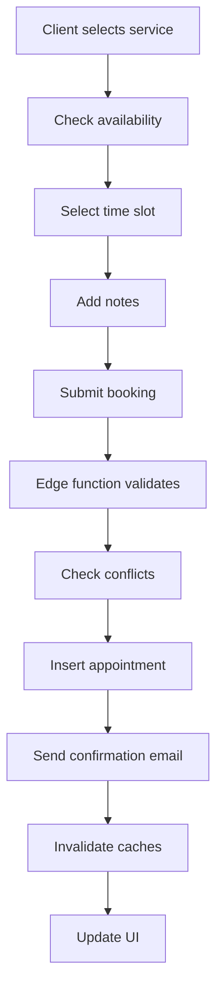
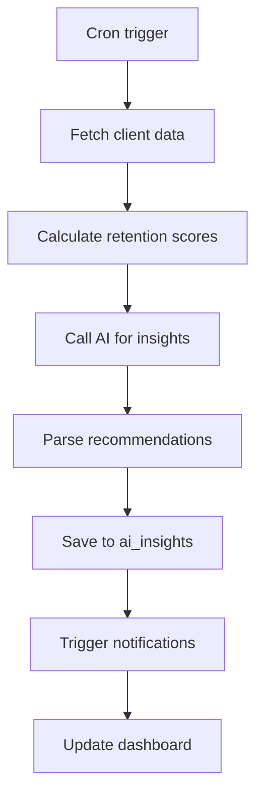
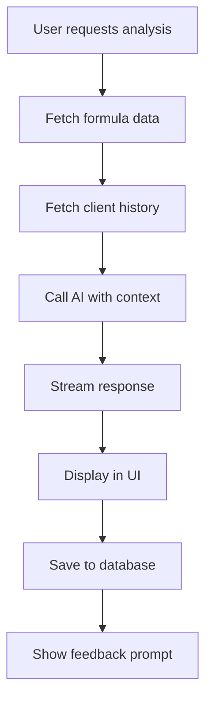

# 📚 hA.I.r Project Knowledge Base

**Generated**: 2025-10-20  
**Version**: 1.0  
**Status**: Production-Ready (Score: 95/100)

---

## 🎯 Project Overview

### What is hA.I.r?

hA.I.r is an **AI-powered salon management platform** designed specifically for hair stylists and their clients. It combines traditional appointment booking and client management with advanced AI features for retention prediction, formula optimization, and business intelligence.

### Target Users

**Primary**: Independent hair stylists and salon owners  
**Secondary**: Salon clients (booking and hair journey tracking)  
**Scale**: Designed to support 1-1000+ stylists per deployment

### Core Value Proposition

1. **AI-Powered Retention** - Predict client churn before it happens
2. **Smart Scheduling** - Optimize appointment gaps and maximize revenue
3. **Formula Library** - Track and analyze color formulas with AI insights
4. **Client Journey** - Visual timeline of hair transformations
5. **Business Intelligence** - Revenue analytics and performance metrics

---

## 🏗️ Architecture

### Tech Stack

**Frontend**:

- React 18.3+ with TypeScript
- Vite (build tool)
- TanStack React Query (data fetching & caching)
- React Router v6 (routing)
- Tailwind CSS + shadcn/ui (design system)
- Zod (validation)

**Backend**:

- Supabase (PostgreSQL database)
- Supabase Edge Functions (Deno runtime)
- Row Level Security (RLS) policies

**AI/ML**:

- Lovable AI Gateway (Gemini 2.5 models)
- OpenAI integration (optional)
- Hugging Face Transformers (background removal)

**Integrations**:

- Stripe (payments & subscriptions)
- Resend (transactional email)
- Twilio (SMS notifications)
- Google Calendar sync (OAuth ready)

**Mobile**:

- Capacitor (native features)
- PWA capabilities
- Camera integration
- Haptic feedback

### Database Schema

**100+ tables** organized into domains:

**Core Entities**:

- `profiles` - User accounts
- `user_roles` - Role-based access (admin, stylist, client)
- `stylist_profiles` - Stylist-specific data
- `client_profiles` - Client-specific data

**Business Logic**:

- `appointments` - Booking system
- `services` - Service catalog
- `formulas` - Hair color formulas
- `hair_photos` - Before/after photos
- `reviews` - Client feedback

**AI/Analytics**:

- `ai_insights` - Generated recommendations
- `client_retention_scores` - Churn prediction
- `client_sentiment_analysis` - NLP analysis
- `ai_analytics_events` - Usage tracking

**Automation**:

- `email_sequences` - Drip campaigns
- `email_sequence_enrollments` - Client enrollments
- `automated_followups` - Triggered messages
- `rebooking_reminders` - Retention automation

**Commerce**:

- `subscription_tiers` - Pricing plans
- `stylist_subscriptions` - Active subscriptions
- `commissions` - Affiliate tracking
- `referrals` - Referral program

---

## 🎨 Key Features

### 1. Dashboard (All Roles)

**Stylist Dashboard**:

- Today's appointments
- Weekly revenue overview
- AI insights widget (churn alerts, upsell opportunities)
- Quick actions (book, add client, create formula)
- Birthday alerts
- Client milestones

**Client Dashboard**:

- Next appointment
- Hair journey timeline
- Preferred stylist card
- Booking history
- Photo gallery

**Admin Dashboard**:

- System health metrics
- User management
- Security audit
- Revenue analytics
- Divine weapon (mass operations)

### 2. Appointment Management

**Booking Flow**:

1. Select stylist
2. Choose service
3. Pick date/time
4. Add notes
5. Confirm booking
6. Receive confirmation (email/SMS)

**Features**:

- Conflict detection
- Calendar view
- Quick appointment dialog
- Status tracking (scheduled, confirmed, in_progress, completed, cancelled)
- Timer widget (track service duration)
- Photo capture (before/after)
- Zapier webhooks

### 3. Client Management

**Client Profiles**:

- Contact info (name, email, phone)
- Hair details (type, allergies, goals)
- Medical consent
- Preferred stylist
- Communication preferences
- Referral source

**Client Features**:

- CSV import
- Search & filtering
- Tags/categories
- History timeline
- Retention scoring
- Sentiment analysis
- Milestone tracking

### 4. Formula Library

**Formula System**:

- Create custom color formulas
- Attach photos
- Add processing notes
- Tag by technique
- Mark favorites
- AI analysis (suggest improvements)

**AI Features**:

- Analyze formula complexity
- Suggest alternatives
- Predict results
- Recommend products

### 5. AI-Powered Features

**Client Retention AI**:

- Churn risk scoring (0-100)
- Risk levels (high, medium, low)
- Days since last visit tracking
- Predicted next visit date
- Recommended actions

**AI Insights**:

- Upsell opportunities
- Re-engagement alerts
- Seasonal trends
- Revenue optimization
- Schedule gaps

**AI Schedule Optimizer**:

- Fill appointment gaps
- Suggest optimal times
- Maximize revenue per day
- Balance workload

**AI Message Composer**:

- Generate client messages
- Personalized tone
- Context-aware suggestions

**Hair Photo Analyzer**:

- Analyze hair condition
- Suggest treatments
- Detect damage
- Recommend products

### 6. Business Analytics

**Revenue Tracking**:

- Daily/weekly/monthly revenue
- Revenue by service
- Revenue by stylist
- Average transaction value
- Client lifetime value

**Performance Metrics**:

- Appointment completion rate
- Cancellation rate
- Rebook rate
- Client retention rate
- Service popularity

**Charts**:

- Revenue trends
- Appointment heatmap
- Service breakdown
- Client acquisition

### 7. Automation & Email

**Email Sequences**:

- Welcome series
- Post-appointment follow-up
- Re-engagement campaigns
- Birthday sequences
- Loyalty programs

**Triggers**:

- Appointment confirmed
- Appointment completed
- X days since last visit
- Birthday approaching
- Milestone reached

**Templates**:

- Customizable content
- Variable substitution
- A/B testing ready
- Unsubscribe management

### 8. Payments & Subscriptions

**Stripe Integration**:

- Subscription tiers (Free, Pro, Team)
- Payment processing
- Invoice generation
- Refund handling
- Webhook processing

**Pricing Tiers**:

- **Free**: 1 stylist, 10 clients
- **Pro** ($29/mo): Unlimited clients, AI features
- **Team** ($99/mo): Multi-stylist, advanced analytics

**Dynamic Pricing** (optional):

- Weekend premium (+20%)
- Off-peak discount (-15%)
- Last-minute surcharge (+30%)
- Advance booking discount (-10%)

### 9. Calendar Sync

**Infrastructure** (OAuth ready):

- Google Calendar integration
- Event sync (bi-directional)
- Conflict detection
- Automatic updates
- Token management (vault-secured)

### 10. Mobile Features

**Native Capabilities**:

- Camera capture
- Photo gallery access
- Haptic feedback
- Push notifications (infrastructure)
- Share functionality
- Offline queue
- Background removal

**PWA**:

- Installable
- Offline support
- App-like experience
- Fast performance

### 11. Communication

**Client Messaging**:

- In-app notifications
- Email notifications
- SMS reminders (Twilio)
- Push notifications (ready)

**Channels**:

- Appointment reminders (24h, 48h)
- Confirmation requests
- Follow-up messages
- Re-engagement
- Birthday wishes

### 12. Reviews & Reputation

**Review System**:

- Star ratings (1-5)
- Written feedback
- Service-specific ratings
- Photo attachments
- Public/private toggle

**Reputation Management**:

- Average rating calculation
- Review moderation
- Response system
- Sentiment analysis

### 13. Reports & Exports

**Data Export**:

- Client list (CSV)
- Appointment history
- Revenue reports
- Formula library
- Photo gallery

**PDF Generation**:

- Invoices
- Service records
- Formula cards
- Reports

### 14. Admin Tools

**User Management**:

- Role assignment
- Access code system (5 slots)
- Subscription management
- Account deletion

**System Tools**:

- Security audit
- Database linter
- Cache management
- Error logs
- Analytics dashboard

**Divine Weapon**:

- Mass client import
- Bulk operations
- Data cleanup
- System recovery

### 15. Onboarding & Tours

**New User Onboarding**:

- Welcome wizard
- Role selection
- Profile setup
- Feature tours (React Joyride)
- Quick start guides

**Guided Tours**:

- Dashboard tour
- Booking flow
- Formula creation
- Client management
- AI features

---

## 🤖 AI Implementation Details

### Lovable AI Gateway

**Base URL**: `https://ai.gateway.lovable.dev/v1/chat/completions`

**Available Models**:

- `google/gemini-2.5-flash` (default) - Fast, balanced
- `google/gemini-2.5-pro` - Most powerful, slower
- `google/gemini-2.5-flash-lite` - Fastest, simple tasks
- `google/gemini-2.5-flash-image-preview` (Nano Banana) - Image generation
- `openai/gpt-5` - Most accurate, expensive
- `openai/gpt-5-mini` - Good balance
- `openai/gpt-5-nano` - Fastest, cheapest

### Edge Functions

**AI-Powered Functions**:

- `chat` - General AI chat
- `analyze-formula` - Formula analysis
- `analyze-retention` - Churn prediction
- `generate-insights` - Business insights
- `optimize-schedule` - Schedule optimization
- `compose-message` - Message generation
- `analyze-hair-photo` - Image analysis

**Authentication**: JWT via Supabase  
**Rate Limits**: Workspace-level limits  
**Error Handling**: 429 (rate limit), 402 (payment required)

### AI Features Architecture

```
Client Request → Edge Function → Lovable AI Gateway → Response
                ↓                                        ↓
         Save to DB                              Stream to Client
                ↓
         Update Cache
```

**Data Flow**:

1. Client triggers AI feature
2. Edge function validates request
3. Fetches context from database
4. Calls Lovable AI with context
5. Streams response to client
6. Saves result to database
7. Invalidates relevant caches

### Prompt Engineering

**System Prompts** (in edge functions):

- Retention analysis: "Analyze client visit patterns..."
- Formula suggestions: "You are an expert hair colorist..."
- Schedule optimization: "Optimize appointment gaps..."

**Context Injection**:

- Client history
- Previous formulas
- Appointment patterns
- Service preferences

---

## 🔐 Security

### Authentication

**Supabase Auth**:

- Email/password
- Magic links
- Google OAuth (ready)
- Session management
- Auto-refresh tokens

**Role System**:

- `admin` - Full system access
- `stylist` - Business management
- `client` - Self-service portal

### Authorization

**Row Level Security (RLS)**:

- 18/18 tables secured
- User can only see own data
- Stylist can see their clients
- Admin can see everything

**Policy Examples**:

```sql
-- Clients can only view their own profile
CREATE POLICY "client_select_own"
ON client_profiles FOR SELECT
USING (user_id = auth.uid());

-- Stylists can view their clients
CREATE POLICY "client_select_by_stylist"
ON client_profiles FOR SELECT
USING (is_client_of_stylist(id, auth.uid()));
```

### Data Protection

**Sensitive Data**:

- Medical info (consent required)
- Payment details (Stripe-hosted)
- API keys (Supabase Vault)
- Passwords (bcrypt hashed)

**Encryption**:

- In transit: TLS 1.3
- At rest: PostgreSQL encryption
- Tokens: Vault-secured

### Input Validation

**Client-Side**: Zod schemas  
**Server-Side**: Database constraints + RLS  
**Sanitization**: HTML/URL/SQL injection prevention

---

## 📊 Database Design Patterns

### Naming Conventions

- Tables: `snake_case`, plural
- Columns: `snake_case`
- Foreign keys: `{table}_id`
- Timestamps: `created_at`, `updated_at`
- Booleans: `is_`, `has_`, `can_`

### Common Patterns

**Soft Deletes**:

```sql
deleted_at timestamptz NULL
```

**Audit Trail**:

```sql
created_at timestamptz DEFAULT now()
updated_at timestamptz DEFAULT now()
created_by uuid REFERENCES profiles(id)
```

**Metadata**:

```sql
metadata jsonb DEFAULT '{}'::jsonb
```

**Status Enums**:

```sql
status text CHECK (status IN ('active', 'inactive', 'pending'))
```

### Relationships

**One-to-Many**:

- Stylist → Clients
- Stylist → Appointments
- Client → Hair Photos

**Many-to-Many**:

- Clients ↔ Services (via appointments)
- Stylists ↔ Specialties (via stylist_specialties)

**Polymorphic**:

- AI conversations (context_type + context_id)
- Notifications (notifiable_type + notifiable_id)

---

## 🚀 Performance Optimizations

### Bundle Optimization

**Code Splitting**:

- Vendor chunk (React, libraries)
- UI chunk (shadcn components)
- Charts chunk (Recharts)
- Supabase chunk
- Route-based lazy loading

**Current Bundle**: ~180KB gzipped

### React Query Caching

**Strategy**:

- `staleTime: 5 minutes` (dashboard)
- `staleTime: 1 minute` (appointments)
- `staleTime: 0` (real-time data)
- `gcTime: 10 minutes` (keep unused)

**Invalidation Patterns**:

- See `src/lib/dataFlow/queryInvalidation.ts`
- Centralized invalidation logic
- Related cache updates

### Database Indexes

**Key Indexes**:

```sql
-- Appointments by date
CREATE INDEX idx_appointments_date
ON appointments(appointment_date);

-- Clients by stylist
CREATE INDEX idx_clients_stylist
ON client_profiles(preferred_stylist_id);

-- Formulas by client
CREATE INDEX idx_formulas_client
ON formulas(client_id);
```

### Image Optimization

**Strategy**:

- WebP format preferred
- Lazy loading
- Background removal (ML)
- Compression (browser-image-compression)
- Responsive images

---

## 🎨 Design System

### Color Palette

**Semantic Tokens** (HSL):

```css
--primary: /* Main brand color */ --secondary: /* Accent color */
  --accent: /* Interactive elements */ --destructive: /* Errors/warnings */
  --muted: /* Backgrounds */ --foreground: /* Text */;
```

**Usage**: ALWAYS use semantic tokens, never hard-coded colors

### Typography

**Font Stack**:

- Primary: System fonts
- Pixel: Retro gaming font (branding)

**Scale**:

- xs: 0.75rem
- sm: 0.875rem
- base: 1rem
- lg: 1.125rem
- xl: 1.25rem
- 2xl+: Larger headings

### Components

**shadcn/ui**:

- Button (variants: default, destructive, outline, secondary, ghost, link)
- Card, Dialog, Sheet, Drawer
- Form (React Hook Form + Zod)
- Table, DataTable
- Toast, Alert
- Badge, Avatar, Separator

**Custom**:

- LoadingSpinner
- ErrorBoundary
- DataErrorBoundary
- OfflineIndicator
- CelebrationAnimation

---

## 📱 Mobile Considerations

### Responsive Breakpoints

```css
xs: 320px
sm: 640px
md: 768px
lg: 1024px
xl: 1280px
2xl: 1536px
```

### Touch Targets

**Minimum**: 44×44px (WCAG AA)  
**Preferred**: 48×48px

### Gestures

- Swipe to delete
- Pull to refresh
- Long press menus
- Pinch to zoom (photos)

### Native Features

**Camera**:

```typescript
import { Camera } from '@capacitor/camera';
const photo = await Camera.getPhoto({
  quality: 90,
  allowEditing: true,
  resultType: CameraResultType.Uri,
});
```

**Haptics**:

```typescript
import { Haptics } from '@capacitor/haptics';
await Haptics.impact({ style: ImpactStyle.Medium });
```

---

## 🔄 Data Flow Examples

### Booking Flow



### AI Insight Generation



### Formula Analysis



---

## 🧪 Testing

### Test Coverage

**Unit Tests**: Component logic, utilities, hooks  
**E2E Tests**: User flows, critical paths  
**Visual Tests**: Screenshot comparison  
**A11y Tests**: WCAG compliance

### Test Files

```
src/__tests__/
  example.test.tsx
  AIComponents.test.tsx

src/components/
  ErrorBoundary.test.tsx
```

### Testing Libraries

- Vitest (test runner)
- Testing Library (React)
- Playwright (E2E)
- Axe (accessibility)

---

## 📦 Deployment

### Build Process

```bash
# Install dependencies
npm install

# Run tests
npm test

# Build for production
npm run build

# Preview
npm run preview
```

### Environment Variables

**Required**:

```env
VITE_SUPABASE_URL=
VITE_SUPABASE_PUBLISHABLE_KEY=
VITE_SUPABASE_PROJECT_ID=
```

**Optional**:

```env
VITE_STRIPE_PUBLIC_KEY=
VITE_GOOGLE_MAPS_KEY=
VITE_SENTRY_DSN=
```

### Edge Function Deployment

**Automatic**: On git push (if using Lovable Cloud)  
**Manual**: Via Supabase CLI

```bash
supabase functions deploy function-name
```

---

## 🐛 Known Issues & Limitations

### Calendar Sync

**Status**: Infrastructure ready, OAuth pending  
**Limitation**: Google OAuth not yet configured  
**Workaround**: Manual appointment entry

### Email Sender Domain

**Status**: Using Resend default domain  
**Limitation**: May land in spam  
**Fix**: Configure custom domain in Resend

### Rate Limits

**AI Gateway**: Per-workspace limits  
**Stripe**: Test mode during development  
**Twilio**: Sandbox mode (verified numbers only)

---

## 📚 Documentation Files

### Core Docs

- `README.md` - Project overview
- `LAUNCH_READINESS_SUMMARY.md` - Production readiness (92/100)
- `GOD_TIER_COMPLETION_REPORT.md` - Feature completion (99/100)
- `FULL_ACTIVATION_COMPLETE.md` - Feature activation status

### Technical Docs

- `SECURITY_REPORT.md` - Security audit
- `RLS_POLICIES.md` - Database security
- `PERF_REPORT.md` - Performance optimization
- `A11Y_AUDIT.md` - Accessibility compliance (802 lines)
- `SEO_REPORT.md` - SEO optimization

### Operational Docs

- `DEPLOYMENT_RUNBOOK.md` - Deployment procedures
- `ANALYTICS_SETUP.md` - Analytics implementation
- `DEBUGGING_ENHANCEMENTS.md` - Debugging patterns (NEW)

---

## 🎯 Development Guidelines

### Code Style

**TypeScript**: Strict mode  
**React**: Functional components + hooks  
**Naming**: camelCase (variables), PascalCase (components)  
**Imports**: Absolute paths via `@/`

### Best Practices

1. **Use semantic tokens** for colors/spacing
2. **Validate all inputs** (client + server)
3. **Log with context** (`flowLogger`, `logger`)
4. **Wrap data components** in `DataErrorBoundary`
5. **Invalidate related caches** after mutations
6. **Handle loading/error/empty states**
7. **Make it mobile-first**
8. **Test on real devices** (not just DevTools)

### Git Workflow

```bash
# Feature branch
git checkout -b feature/new-feature

# Commit with context
git commit -m "feat: add client CSV import"

# Push and deploy
git push origin feature/new-feature
```

---

## 🔮 Future Roadmap

### Q1 2025

- [ ] Complete Google Calendar OAuth
- [ ] Custom email domain setup
- [ ] Mobile app (iOS/Android)
- [ ] Multi-language support
- [ ] Advanced AI features

### Q2 2025

- [ ] Inventory management
- [ ] Product recommendations
- [ ] Team collaboration features
- [ ] Advanced analytics
- [ ] API for third-party integrations

---

## 🆘 Troubleshooting

### Common Issues

**Build Errors**:

- Clear node_modules and reinstall
- Check TypeScript errors
- Verify environment variables

**Auth Issues**:

- Check RLS policies
- Verify JWT tokens
- Check user roles

**AI Errors**:

- Check rate limits (429)
- Verify credits (402)
- Check edge function logs

**Performance**:

- Check bundle size
- Review React Query cache
- Check database indexes
- Enable production mode

### Debug Commands

```bash
# Check logs
supabase functions logs function-name

# Test edge function
curl -X POST https://[project].supabase.co/functions/v1/function

# Check database
psql -h db.[project].supabase.co -U postgres

# Analyze bundle
npm run build -- --analyze
```

---

## 📞 Support

**Documentation**: This file + `LAUNCH_READINESS_SUMMARY.md`  
**Issues**: GitHub Issues (if using GitHub)  
**Community**: Lovable Discord  
**Email**: support@lovable.dev (for platform issues)

---

**Last Updated**: 2025-10-20  
**Maintained By**: Development Team  
**Version**: 1.0 (Production Ready)

---

## 🎓 Learning Resources

### For New Developers

1. Read `LAUNCH_READINESS_SUMMARY.md` first
2. Review `GOD_TIER_COMPLETION_REPORT.md` for features
3. Study `SECURITY_REPORT.md` for security context
4. Check `DEBUGGING_ENHANCEMENTS.md` for development patterns
5. Read this file for architecture understanding

### Key Concepts

- **RLS** - Row Level Security (database security)
- **Edge Functions** - Serverless backend (Deno)
- **React Query** - Data fetching & caching
- **shadcn/ui** - Component library
- **Lovable AI** - AI gateway service
- **Semantic tokens** - Design system approach

### External Resources

- [Lovable Docs](https://docs.lovable.dev)
- [Supabase Docs](https://supabase.com/docs)
- [React Query Docs](https://tanstack.com/query/latest)
- [shadcn/ui](https://ui.shadcn.com)
- [Tailwind CSS](https://tailwindcss.com)

---

**This knowledge base captures the current state of the hA.I.r platform at T=0. Use it as a reference for understanding the system, onboarding new developers, and maintaining consistency in future development.**
