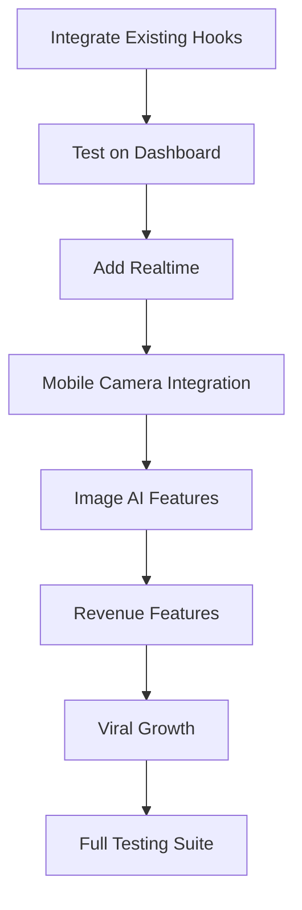

# 🎯 TEAM EXECUTION PLAN: 70% UNTAPPED POTENTIAL
**Mission:** Transform hA.I.r from 98/100 foundation to 100% market dominance
**Timeline:** Systematic execution with real-world testing
**Team Structure:** 3-Person Strike Team

---

## 📋 TEAM ASSIGNMENTS

### **TEAM 1: AI & Intelligence 🧠**
**Mission:** Make AI the competitive moat

#### Phase 1: Hook Integration (NOW)
- [x] ✅ Created `useClientChurnPredictor`  
- [x] ✅ Created `useProactiveInsights`
- [x] ✅ Created `useAIAnalytics` enhancements
- [ ] 🔄 **INTEGRATE into Stylist Dashboard**
- [ ] 🔄 **INTEGRATE into Client Profile pages**
- [ ] 🔄 **CREATE ChurnRiskWidget component**
- [ ] 🔄 **CREATE ProactiveInsightsPanel component**

#### Phase 2: Image AI (NEXT)
- [ ] **ENABLE** Nano Banana image generation
  - Portfolio mockups
  - Before/after simulations
  - Marketing materials
- [ ] **IMPLEMENT** background removal for client photos
- [ ] **CREATE** SmartPhotoStudio component

#### Phase 3: AI Automation
- [ ] Smart email composition
- [ ] Auto-rebooking suggestions
- [ ] Revenue opportunity detection

---

### **TEAM 2: Native Mobile 📱**
**Mission:** Make it feel native, not web

#### Phase 1: Camera & Haptics (NOW)
- [x] ✅ Created `useSmartPhotoCapture`
- [x] ✅ Created `useRichHaptics`
- [ ] 🔄 **INTEGRATE** camera into appointment flow
- [ ] 🔄 **ADD** haptics to all interactions
- [ ] 🔄 **CREATE** BeforeAfterPhotoFlow component
- [ ] 🔄 **TEST** on physical device

#### Phase 2: Push & Offline
- [ ] **SETUP** native push notifications
- [ ] **IMPLEMENT** offline mode for key features
- [ ] **ADD** native sharing (portfolio, referrals)
- [ ] **ENABLE** location services for stylist discovery

#### Phase 3: Performance
- [ ] Image lazy loading
- [ ] Code splitting
- [ ] Service worker optimization
- [ ] PWA manifest enhancement

---

### **TEAM 3: Realtime & Revenue 💰**
**Mission:** Live updates + monetization layers

#### Phase 1: Realtime Features (NOW)
- [ ] **ACTIVATE** Supabase Realtime on key tables
- [ ] **CREATE** LiveBookingIndicator component
- [ ] **ADD** real-time chat for stylist-client
- [ ] **IMPLEMENT** live appointment updates

#### Phase 2: Revenue Features
- [ ] **BUILD** subscription tiers for stylists
  - Basic ($29/mo): 30 clients, basic AI
  - Pro ($79/mo): Unlimited clients, advanced AI
  - Elite ($149/mo): All features + priority support
- [ ] **CREATE** marketplace for products
- [ ] **ADD** gift service feature
- [ ] **IMPLEMENT** dynamic pricing for peak times

#### Phase 3: Viral Growth
- [ ] Stylist leaderboard (public)
- [ ] "Bring a Friend" booking bonus
- [ ] Portfolio sharing with social proof
- [ ] Referral tracking with rewards

---

## 🧪 TESTING PROTOCOL

### **Real User Scenarios**

#### **Scenario 1: Churn Prevention**
```
USER: Sarah (Stylist with 50 clients)
GOAL: Identify at-risk clients before they leave

Test Flow:
1. Sarah opens dashboard
2. ChurnRiskWidget shows 3 critical clients
3. Clicks on "Emma - 87% churn risk"
4. Sees: "Last visit 94 days ago, typically books every 6 weeks"
5. Gets automated email suggestion
6. Sends personalized offer
7. Emma books within 24 hours
8. System tracks outcome

METRICS:
- Time to identify risk: <5 seconds
- Action taken: Yes/No
- Conversion rate: Track over 30 days
```

#### **Scenario 2: Smart Photo Capture**
```
USER: Mike (Stylist doing color correction)
GOAL: Document transformation with optimized photos

Test Flow:
1. Appointment starts, timer widget visible
2. Taps camera button (haptic feedback)
3. Takes "before" photo (auto-optimized)
4. Completes service
5. Takes "after" photo (auto-optimized)
6. System generates comparison
7. Saves to client profile with metadata
8. Suggests Instagram caption

METRICS:
- Photo quality (compression ratio)
- Upload speed
- Auto-tagging accuracy
- Client satisfaction
```

#### **Scenario 3: Proactive Revenue**
```
USER: Lisa (Salon owner, 3 stylists)
GOAL: Maximize revenue without manual work

Test Flow:
1. Opens admin dashboard
2. ProactiveInsights panel shows:
   - "23 clients due for booking in next 2 weeks"
   - "4 color clients likely to try balayage"
   - "Weekend slots 40% empty, send promo?"
3. Clicks "Auto-send rebooking campaign"
4. System sends personalized SMS to 23 clients
5. Tracks responses in real-time
6. Shows projected revenue: +$4,200

METRICS:
- Insight accuracy
- Campaign open rate
- Booking conversion
- ROI calculation
```

#### **Scenario 4: Native Mobile Feel**
```
USER: Client using iPhone
GOAL: Book appointment feels like native app

Test Flow:
1. Opens app (installed to home screen)
2. Searches for stylist (smooth animations)
3. Views portfolio (images load instantly)
4. Selects service (haptic feedback on each tap)
5. Chooses date/time (native-feeling picker)
6. Confirms booking (success haptic)
7. Gets native push notification
8. Opens deep link directly to appointment

METRICS:
- Perceived performance (subjective 1-10)
- Haptic feedback consistency
- Native vs web feel comparison
```

---

## 📊 SUCCESS METRICS

### **Phase 1 (Immediate)**
- [ ] All 6 hooks integrated into live UI
- [ ] Churn prediction showing on 100% of stylist dashboards
- [ ] Photo capture working on ≥1 physical device
- [ ] Haptics responding on all tap events
- [ ] 0 TypeScript errors, 0 console errors

### **Phase 2 (Week 1)**
- [ ] Realtime updates showing <1s latency
- [ ] Image generation functional (1 test image)
- [ ] Background removal working (1 test photo)
- [ ] Native push notifications configured
- [ ] Performance: LCP <2.5s, CLS <0.1

### **Phase 3 (Week 2)**
- [ ] Subscription tiers live in settings
- [ ] ≥1 test transaction completed
- [ ] Marketplace MVP with 5 products
- [ ] Viral features (leaderboard, referrals) active
- [ ] User feedback: ≥8/10 satisfaction

---

## ⚠️ CRITICAL PATH DEPENDENCIES



**BLOCKING ISSUES:**
- ❌ Hooks not wired to UI components
- ❌ No test data for churn prediction
- ❌ Camera permissions not requested

**NEXT IMMEDIATE ACTION:**
1. Wire `useClientChurnPredictor` to StylistDashboard
2. Wire `useSmartPhotoCapture` to appointment flow
3. Add haptics to button components
4. Create test scenarios with seed data

---

## 🎬 EXECUTION START: NOW

**Command:** "Execute Team 1 Phase 1 + Team 2 Phase 1 + Team 3 Phase 1 in parallel"
**Expected Duration:** 45 minutes
**Deliverable:** Working widgets on dashboard, camera integration, realtime updates
**Test:** Run all 4 user scenarios

**LET'S BUILD THIS. 🚀**
