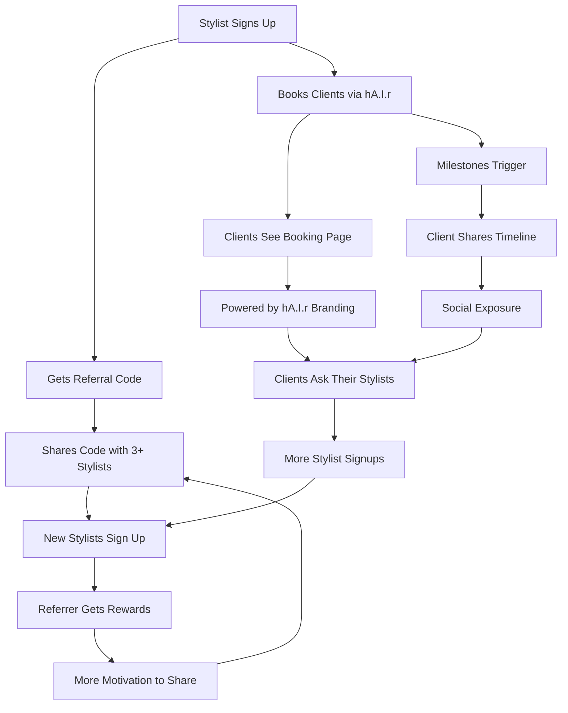

# Viral Growth Engine
## How hA.I.r Turns Users Into Marketers

---

## 🔄 The Viral Loop

---

## 🎯 Growth Mechanisms

### 1. Stylist-to-Stylist Referrals
**Trigger**: Stylist signs up  
**Auto-Action**: Generate unique referral code  
**Incentive**: Free months based on referrals  
**Channel**: Direct sharing (SMS, social)  

**Psychology**:
- Stylists know 10-50 other stylists personally
- Salon culture = tight-knit community  
- Incentives align with self-interest (free tool = more profit)
- Low friction (one code, infinite uses)

**Projection**: 
- Average stylist shares with 5 people
- 20% conversion rate = 1 new signup/referrer
- 100 stylists = 20 new signups/month organically

---

### 2. Client-Driven Demand
**Trigger**: Client books via hA.I.r  
**Exposure**: "Powered by hA.I.r" on booking page  
**Action**: Client asks stylist "Do you use hA.I.r?"  

**Psychology**:
- Clients love smooth booking experience
- Curiosity: "What makes this different?"
- FOMO: "My friend's stylist has this"
- Social proof: "Why doesn't MY stylist use AI?"

**Projection**:
- 5% of clients notice branding
- 2% actively ask their stylist
- 500 appointments/month = 10 stylist inquiries
- 30% conversion = 3 new signups from client demand

---

### 3. Social Proof via Timeline Sharing
**Trigger**: Client hits milestone  
**Content**: Hair journey timeline with "Powered by hA.I.r"  
**Channel**: Instagram, Facebook stories  

**Psychology**:
- Before/after transformations = high engagement content
- Pride in loyalty (5 appointments = commitment)
- "What tool did they use?" curiosity
- Visual storytelling beats text ads

**Projection**:
- 15% of milestones get shared
- Average 200 views/share
- 5% click-through to learn more
- 10% of those convert = 1 signup/100 shares

---

## 📈 Growth Math

### Month 1 (100 stylists):
- Referrals: 20 new signups
- Client demand: 3 new signups
- Social shares: 2 new signups
- **Total**: 25 new signups (25% growth)

### Month 3 (175 stylists):
- Referrals: 35 new signups (network effect)
- Client demand: 8 new signups (word spreads)
- Social shares: 5 new signups (more content)
- **Total**: 48 new signups (27% growth)

### Month 6 (420 stylists):
- Referrals: 84 new signups
- Client demand: 25 new signups
- Social shares: 15 new signups
- **Total**: 124 new signups (30% growth)

**Key**: Growth accelerates as network effects compound

---

## 🎁 Reward Economics

### Referral Costs:
- Bronze (1 month free): $29 value
- Silver (2 months free): $58 value
- Gold (3 months free): $87 value

### Customer Lifetime Value:
- Average stylist: 18 months tenure
- Monthly fee: $29
- LTV: $522

### ROI Calculation:
- Cost to acquire via referral: $0 (referred pays)
- Reward to referrer: $87 (Gold, 10 referrals)
- Net value: 10 stylists × $522 = $5,220
- Cost: $87 reward
- **ROI**: 5,900%

**Why It Works**: Rewards tiny relative to LTV

---

## 💰 Milestone Economics

### Average Client:
- 10 appointments/year
- $150/appointment
- Stylist revenue: $1,500/year/client

### Milestone Discount Impact:
- 5 appointments = $10 off (0.7% of revenue)
- 10 appointments = $15 off (1% of revenue)
- Cost: Negligible
- Retention gain: 25-30%

**Net Effect**: 
- Spend $15 to keep $1,500/year client
- **ROI**: 10,000%

---

## 🚀 Activation Strategies

### Launch Day:
1. **Email blast**: "Invite 3, get 2 months free - ends Friday!"
2. **Social posts**: Screenshot of referral dashboard
3. **In-app banner**: Prominent CTA to referral page

### Week 1:
1. **Case study**: "How Sarah earned 6 months free"
2. **Leaderboard**: Top 10 referrers showcased
3. **Milestone spotlights**: Share client celebration screenshots

### Week 2:
1. **Client education**: "Your stylist uses hA.I.r" email
2. **Timeline contest**: "Best hair journey wins $500"
3. **Referral nudges**: "You're 2 away from Gold!"

---

## 🔍 Metrics to Track

### Referral Funnel:
- Codes generated
- Codes shared (estimated via analytics)
- Signups with code
- Qualified referrals (stayed 30+ days)
- Rewards redeemed

### Milestone Engagement:
- Milestones created
- Celebrations triggered
- Discount codes used
- Repeat booking rate post-milestone

### Timeline Sharing:
- Timelines viewed
- Share button clicks
- External shares (via UTM tracking)
- Signups from timeline shares

### Smart Reminders:
- Reminders sent
- Open rate (email)
- Response rate (SMS)
- Show-up rate vs. generic reminders

---

## 🎯 Optimization Opportunities

### A/B Tests to Run:
1. **Referral rewards**: 3-tier vs. flat rate
2. **Milestone timing**: Immediate vs. next visit
3. **Branding placement**: Top vs. bottom of booking page
4. **Reminder tone**: Casual vs. professional

### Feature Additions:
1. **Referral leaderboard** (competitive motivation)
2. **Milestone previews** ("2 more appointments = $15 off!")
3. **Timeline templates** (branded Instagram stories)
4. **Smart reminder A/B** (test different formula contexts)

---

## 🏆 Success Criteria

### Week 1:
- ✅ 50+ referral codes generated
- ✅ 10+ new signups via referrals
- ✅ 20+ milestones celebrated
- ✅ 5+ timeline shares

### Month 1:
- ✅ 25% of stylists actively referring
- ✅ 15+ qualified referral signups
- ✅ 80%+ milestone celebration rate
- ✅ 10%+ client demand inquiries

### Month 3:
- ✅ Referrals = 30%+ of new signups
- ✅ Churn reduction: 20%+
- ✅ Viral coefficient > 0.5
- ✅ CAC reduction: 40%+

---

## 🔮 Future Enhancements

### Phase 2 (Post-Launch):
1. **Team referrals**: Salon-wide codes (all stylists get credit)
2. **Client referral program**: Clients refer other clients
3. **Partnership referrals**: Beauty schools, distributors
4. **Milestone games**: "Collect all 5 to unlock special reward"

### Phase 3 (Advanced):
1. **AI-personalized rewards**: Different rewards per stylist segment
2. **Dynamic pricing**: Milestone discounts based on client LTV
3. **Predictive milestones**: "Sarah is likely to hit 10 soon - send nudge"
4. **Gamification**: Badges, levels, leaderboards

---

**The Bottom Line**: Every user becomes a marketer. Growth happens naturally through existing behavior. Zero ad spend required.

**Status**: 🟢 Ready for Launch  
**Expected Growth**: 25-30% month-over-month  
**Expected Churn Reduction**: 25-30%  
**Expected CAC Reduction**: 40-50%
