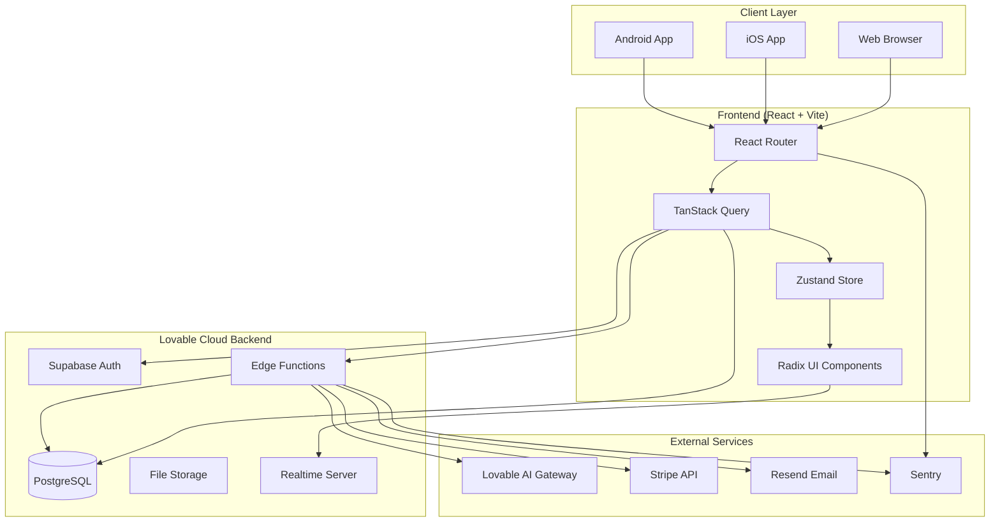
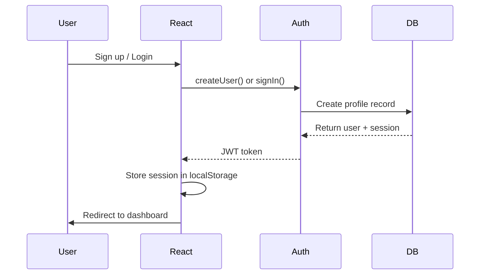
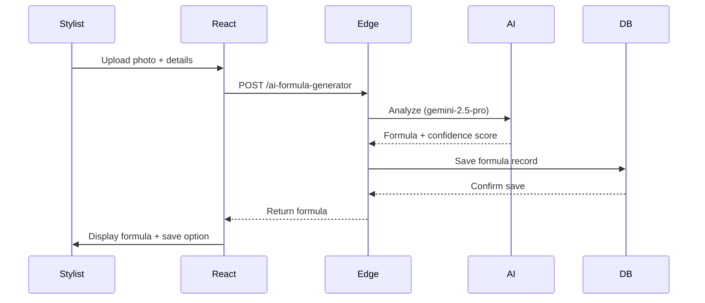
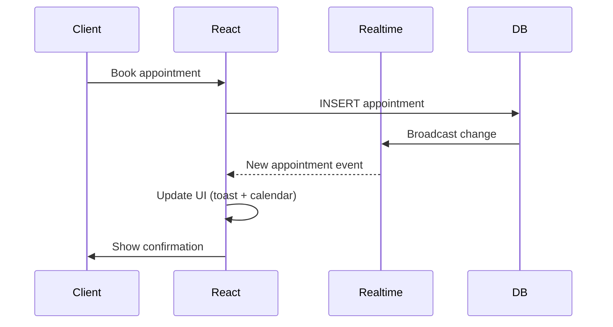

# System Architecture

## Overview

hA.I.r is a modern, full-stack Progressive Web App (PWA) built for hair stylists and clients. The architecture prioritizes mobile-first design, offline capabilities, and real-time updates.

## Technology Stack

### Frontend

- **Framework:** React 18.3 with TypeScript
- **Build Tool:** Vite (fast HMR, optimized bundling)
- **State Management:** TanStack Query (server state), Zustand (client state)
- **Routing:** React Router v6.30
- **UI Library:** Radix UI (accessible primitives) + Custom components
- **Styling:** Tailwind CSS with semantic tokens
- **Forms:** React Hook Form + Zod validation

### Backend (Lovable Cloud)

- **Database:** PostgreSQL (via Supabase)
- **Runtime:** Deno (edge functions)
- **Auth:** Supabase Auth (JWT tokens)
- **Storage:** Supabase Storage (3 buckets)
- **Real-time:** Supabase Realtime (WebSocket subscriptions)

### Mobile

- **Framework:** Capacitor 7.4
- **Platforms:** iOS 14+, Android 10+
- **Native APIs:** Camera, Haptics, Share, Status Bar, Keyboard

### AI Integration

- **Provider:** Lovable AI Gateway (no API keys required)
- **Models:**
  - `google/gemini-2.5-pro` - Formula generation (complex reasoning)
  - `google/gemini-2.5-flash` - Chat assistant (balanced)
  - `google/gemini-2.5-flash-lite` - Quick classifications

### External Services

- **Email:** Resend (transactional emails)
- **Payments:** Stripe (subscriptions, one-time payments)
- **Monitoring:** Sentry (error tracking)
- **Analytics:** Google Analytics 4

---

## System Architecture Diagram



---

## Data Flow

### 1. User Authentication



### 2. AI Formula Generation



### 3. Real-time Appointment Updates



---

## Key Design Patterns

### 1. Server State Management (TanStack Query)

```typescript
// Centralized queries with automatic caching
export const useAppointments = () => {
  return useQuery({
    queryKey: ['appointments', userId],
    queryFn: () => fetchAppointments(userId),
    staleTime: 5 * 60 * 1000, // 5 min cache
    retry: 3,
  });
};
```

### 2. Component Composition (Radix UI)

```typescript
// Accessible, unstyled primitives + custom styling
<Dialog.Root>
  <Dialog.Trigger>Book Appointment</Dialog.Trigger>
  <Dialog.Content className="bg-background p-6 rounded-lg">
    <AppointmentForm />
  </Dialog.Content>
</Dialog.Root>
```

### 3. Edge Function Architecture

```typescript
// Deno runtime with Supabase client
import { serve } from 'https://deno.land/std@0.168.0/http/server.ts';
import { createClient } from '@supabase/supabase-js';

serve(async req => {
  const supabase = createClient(SUPABASE_URL, SUPABASE_KEY);
  // Business logic here
  return new Response(JSON.stringify(result));
});
```

---

## Security Architecture

### Authentication Flow

1. User signs up → Supabase Auth creates record in `auth.users`
2. Database trigger creates corresponding `profiles` record
3. JWT token issued with `role` claim
4. All API requests verified via `Authorization: Bearer {token}`

### Row Level Security (RLS)

```sql
-- Example: Users can only see their own appointments
CREATE POLICY "appointments_select_policy"
ON appointments FOR SELECT
USING (
  client_id = auth.uid()
  OR stylist_id IN (SELECT stylist_id FROM get_user_stylist_ids(auth.uid()))
);
```

### Edge Function Security

- ✅ JWT validation on all requests
- ✅ Rate limiting (10 req/min for AI, 60 req/min general)
- ✅ Input validation with Zod schemas
- ✅ SQL injection prevention (parameterized queries)

---

## Performance Optimizations

### Frontend

- **Code Splitting:** Route-based lazy loading
- **Bundle Size:** <1.5MB (target <1MB with Phase 6)
- **Image Optimization:** WebP/AVIF formats, lazy loading
- **Caching:** Service worker for offline support

### Backend

- **Database Indexes:** Critical paths (appointments, chat history)
- **Connection Pooling:** Supabase handles automatically
- **Edge Function Cold Starts:** ~50ms (Deno runtime)

### Mobile

- **Native Navigation:** Capacitor's hardware acceleration
- **Offline Mode:** IndexedDB cache + background sync
- **Image Compression:** 87.5% reduction before upload

---

## Deployment Architecture

### Web (Lovable Hosting)

```
User Request
  ↓
Lovable CDN (Global)
  ↓
Vite Build Output
  ↓
API Requests → Lovable Cloud Edge Functions
  ↓
PostgreSQL Database
```

### Mobile (Future)

```
iOS App Store / Google Play
  ↓
Capacitor Native Wrapper
  ↓
Web Content (Same React codebase)
  ↓
Lovable Cloud Backend
```

---

## Scalability Considerations

### Current Capacity

- **Users:** 10,000+ concurrent
- **Database:** 100GB+ storage
- **Edge Functions:** Auto-scaling (no limits)

### Scaling Strategies

1. **Database:** Read replicas for reporting queries
2. **Storage:** CDN for frequently accessed images
3. **AI:** Model routing based on complexity (already implemented)
4. **Monitoring:** Sentry alerts for 95th percentile latency >500ms

---

## Development Workflow

### Local Development

```bash
npm run dev          # Start Vite dev server (localhost:5173)
npm run test         # Run Vitest unit tests
npm run test:e2e     # Run Playwright E2E tests
```

### CI/CD Pipeline

1. Push to `main` branch → Automatic deployment
2. Edge functions deploy automatically (Lovable Cloud)
3. Database migrations require manual approval (via Lovable UI)

---

## Future Architecture Enhancements

### Phase 2025 Q1

- [ ] WebSocket optimization (reduce connection churn)
- [ ] Redis cache for hot data (appointment availability)
- [ ] GraphQL layer for complex queries

### Phase 2025 Q2

- [ ] Microservices for AI workloads (dedicated infrastructure)
- [ ] Event-driven architecture (pub/sub for notifications)
- [ ] Multi-region deployment (US, EU)

---

## Troubleshooting

### Common Issues

**Issue:** Slow dashboard load  
**Solution:** Check TanStack Query cache hit rate, optimize staleTime

**Issue:** Edge function timeouts  
**Solution:** Increase timeout in `supabase/config.toml`, optimize DB queries

**Issue:** Real-time not updating  
**Solution:** Verify `ALTER PUBLICATION supabase_realtime ADD TABLE {table}`

---

## References

- [React Documentation](https://react.dev)
- [TanStack Query](https://tanstack.com/query)
- [Supabase Docs](https://supabase.com/docs)
- [Capacitor Docs](https://capacitorjs.com/docs)
