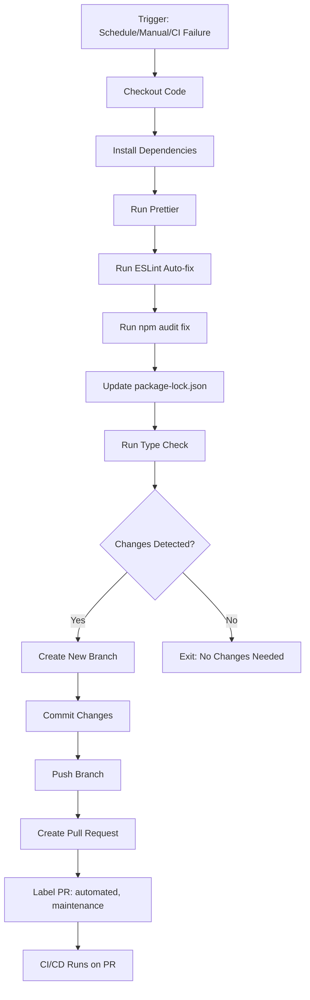

# Auto-Fix Workflow Documentation

## Overview

The Auto-Fix workflow automatically detects and fixes common code quality, formatting, and security issues, then creates pull requests for review. This reduces manual maintenance work while keeping you in control.

**Workflow File:** `.github/workflows/auto-fix.yml`

---

## What It Fixes

### 1. Code Formatting
- **Action:** Runs `npm run format` (Prettier)
- **Fixes:** Indentation, line breaks, quote styles, trailing commas
- **Impact:** Ensures consistent code style across the project

### 2. Linting Auto-Fixes
- **Action:** Runs `npm run lint:fix` (ESLint)
- **Fixes:** Unused imports, missing semicolons, spacing issues, simple code smells
- **Impact:** Addresses auto-fixable code quality problems

### 3. Dependency Security
- **Action:** Runs `npm audit fix`
- **Fixes:** Known security vulnerabilities in dependencies
- **Impact:** Patches security issues automatically

### 4. Package Lock Updates
- **Action:** Updates `package-lock.json`
- **Fixes:** Ensures lock file is in sync with `package.json`
- **Impact:** Prevents dependency resolution issues

### 5. Type Safety Verification
- **Action:** Runs `npm run type-check`
- **Fixes:** N/A (validation only)
- **Impact:** Ensures fixes don't break TypeScript compilation

---

## Trigger Conditions

### 1. Scheduled (Automatic)
- **When:** Every Monday at 2 AM UTC
- **Why:** Weekly maintenance to catch accumulated issues
- **Frequency:** Once per week

### 2. Manual Trigger
- **When:** You trigger it from GitHub Actions tab
- **How:** 
  1. Go to `https://github.com/[your-repo]/actions`
  2. Select "Auto Fix Issues" workflow
  3. Click "Run workflow"
  4. Select branch (usually `main`)
  5. Click "Run workflow" button

### 3. On CI/CD Failure (Optional)
- **When:** After CI/CD workflow fails
- **Why:** Automatically attempts to fix issues that caused the failure
- **Note:** Currently enabled - runs when CI/CD completes with failure

---

## Workflow Process



---

## Safety Features

### ✅ Review Before Merge
- **All fixes create PRs** - no auto-merge
- You review and approve every change
- Full diff visibility for transparency

### ✅ Type Safety Checks
- TypeScript compilation verified before PR creation
- Ensures fixes don't break existing functionality

### ✅ CI/CD Integration
- Your existing CI/CD pipeline runs on auto-fix PRs
- All quality checks must pass before merge

### ✅ No PR Spam
- Only creates PR if changes actually exist
- Exits gracefully if no fixes are needed

### ✅ Clear Attribution
- Uses GitHub Actions bot account
- Clear commit messages and PR descriptions
- Easy to track automated changes

---

## PR Structure

### Title Format
```
🤖 Auto-fix: Code quality and security updates
```

### Labels Applied
- `automated` - Identifies bot-created PRs
- `maintenance` - Categorizes as maintenance work
- `auto-fix` - Specific to auto-fix workflow

### PR Description Includes
- ✨ List of fixes applied
- 🔧 Quality checks performed
- 📊 Workflow metadata (run ID, trigger)
- 📝 Review guidelines for maintainers

### Commit Message Format
```
🤖 Auto-fix: Code formatting, linting, and dependency updates

Automated fixes applied:
- ✨ Code formatting (Prettier)
- 🔧 Linting fixes (ESLint)
- 🔒 Security patches (npm audit fix)
- 📦 Dependency updates

Generated by: Auto Fix Issues
Triggered by: schedule
Run: 123456789
```

---

## Integration with Existing Workflows

### Works Alongside
- **CI/CD Pipeline** (`.github/workflows/ci.yml`)
  - Auto-fix PRs trigger full CI/CD checks
  - Linting, type checking, tests run automatically
  
- **Dependabot** (`.github/dependabot.yml`)
  - Dependabot handles dependency version updates
  - Auto-fix handles code-level fixes and security patches
  
- **Performance Check** (`.github/workflows/performance-check.yml`)
  - Runs on auto-fix PRs to verify performance impact
  
- **Security Scan** (`.github/workflows/security-scan.yml`)
  - Runs on auto-fix PRs to verify security improvements

### PR Template Compliance
- Auto-fix PRs include checklist from `.github/pull_request_template.md`
- All standard PR checks apply

---

## Expected Outcomes

### Time Savings
- **Before:** 2-5 hours/week on manual formatting, linting, security patches
- **After:** ~15 minutes/week reviewing auto-fix PRs
- **Net Savings:** ~2-4.5 hours/week

### Issue Resolution Rate
- **Formatting Issues:** 95-100% auto-fixed
- **Linting Issues:** 70-90% auto-fixed (some require manual intervention)
- **Security Patches:** 80-95% auto-fixed
- **Overall:** ~70-90% of common issues handled automatically

### Code Quality Improvements
- ✅ Consistent code style across project
- ✅ Fewer linting warnings in PRs
- ✅ Up-to-date dependencies with security patches
- ✅ Reduced technical debt accumulation

---

## Monitoring & Maintenance

### View Auto-Fix PRs
```
https://github.com/[your-repo]/pulls?q=is%3Apr+label%3Aautomated
```

### View Workflow Runs
```
https://github.com/[your-repo]/actions/workflows/auto-fix.yml
```

### Check Success Rate
1. Go to Actions → Auto Fix Issues
2. Review recent runs
3. Check pass/fail ratio
4. Investigate failures if > 10% failure rate

### Workflow Health Indicators

#### 🟢 Healthy
- PRs created weekly or as needed
- CI/CD passes on auto-fix PRs
- Changes are consistently small and focused

#### 🟡 Needs Attention
- PRs failing CI/CD checks
- Large diffs (> 500 lines changed)
- Frequent conflicts with main branch

#### 🔴 Critical
- Workflow consistently failing
- Breaking changes introduced
- Security patches causing regressions

---

## Customization Options

### Disable Specific Fix Types
Edit `.github/workflows/auto-fix.yml` and comment out steps:

```yaml
# Disable Prettier formatting
# - name: Run Prettier (Format)
#   run: npm run format || true
#   continue-on-error: true
```

### Change Schedule
Modify the cron expression:

```yaml
# Current: Every Monday at 2 AM UTC
- cron: '0 2 * * 1'

# Daily at midnight UTC
- cron: '0 0 * * *'

# Every 6 hours
- cron: '0 */6 * * *'
```

### Disable CI Failure Trigger
Remove or comment out:

```yaml
# workflow_run:
#   workflows: ["CI/CD"]
#   types: [completed]
#   branches: [main]
```

### Add Custom Fix Scripts
Add new steps before the "Check for changes" step:

```yaml
- name: Custom fix script
  run: npm run custom:fix || true
  continue-on-error: true
```

---

## Troubleshooting

### Problem: PRs Not Being Created

**Possible Causes:**
- No changes detected (workflow exits gracefully)
- GitHub token permissions insufficient
- Branch protection rules blocking bot

**Solutions:**
1. Check workflow logs for "No changes detected" message
2. Verify `contents: write` and `pull-requests: write` permissions
3. Update branch protection to allow `github-actions[bot]`

### Problem: CI/CD Failing on Auto-Fix PRs

**Possible Causes:**
- Auto-fixes introducing breaking changes
- Type check passing locally but failing in CI
- Dependency conflicts

**Solutions:**
1. Review auto-fix PR diff carefully
2. Test locally: `git checkout [auto-fix-branch]`
3. Run `npm run type-check` and `npm test` locally
4. Fix issues and push to auto-fix branch

### Problem: Large Diffs in Auto-Fix PRs

**Possible Causes:**
- First run after enabling workflow
- Major dependency updates
- Formatter config changed

**Solutions:**
1. Review large changes carefully before merging
2. Consider splitting into multiple PRs manually
3. Adjust `.prettierrc` or `eslint.config.js` if needed

### Problem: Merge Conflicts

**Possible Causes:**
- Auto-fix branch out of sync with main
- Simultaneous changes to same files

**Solutions:**
1. Close auto-fix PR
2. Run workflow manually to create fresh PR
3. Or manually resolve conflicts:
   ```bash
   git checkout [auto-fix-branch]
   git merge main
   git push
   ```

---

## Best Practices

### ✅ DO
- Review auto-fix PRs within 24-48 hours
- Merge auto-fix PRs promptly to avoid conflicts
- Run manual fixes before major releases
- Monitor workflow health weekly

### ❌ DON'T
- Auto-merge without review (keep oversight)
- Ignore failed auto-fix workflows
- Disable workflow without investigation
- Let auto-fix PRs accumulate

---

## Metrics to Track

### Workflow Performance
- **PR Creation Rate:** Should be ~1 PR/week on schedule
- **Success Rate:** Target > 90% successful runs
- **CI Pass Rate on PRs:** Target > 95%

### Code Quality Impact
- **Linting Warnings:** Should trend downward
- **Security Vulnerabilities:** Should stay at 0 (high/critical)
- **Code Style Consistency:** Should improve (fewer formatting PRs)

### Time Savings
- **Manual Fix Time:** Track hours saved per week
- **PR Review Time:** Should be < 15 min/week for auto-fix PRs
- **Context Switching:** Fewer interruptions for minor fixes

---

## Related Documentation

- [CI/CD Pipeline](.github/workflows/ci.yml)
- [GitHub Automation Strategy](GITHUB_AUTOMATION.md)
- [Contributing Guidelines](../CONTRIBUTING.md)
- [Pull Request Template](.github/pull_request_template.md)

---

## Support

### Questions or Issues?
1. Check workflow logs first
2. Review this documentation
3. Check GitHub Actions documentation
4. Open an issue in the repository

### Feature Requests
Want additional auto-fixes? Consider:
- Adding new npm scripts to `package.json`
- Creating custom fix scripts
- Proposing additions to this workflow

---

**Last Updated:** 2025-11-02  
**Workflow Version:** 1.0.0  
**Maintainer:** Development Team
