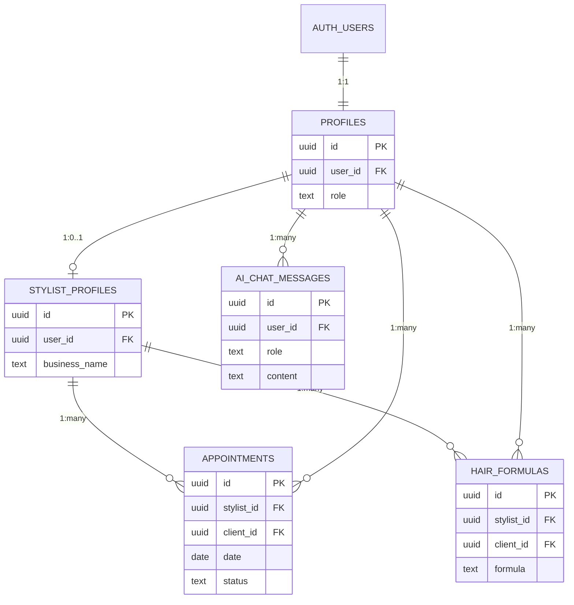

# Database Schema Documentation

## Overview

This document describes the PostgreSQL database schema for hA.I.r, including table relationships, RLS policies, and indexes.

## Core Tables

### `profiles`

**Purpose:** Extended user information (1:1 with auth.users)

| Column     | Type        | Description                      |
| ---------- | ----------- | -------------------------------- |
| id         | uuid        | Primary key                      |
| user_id    | uuid        | FK to auth.users (unique)        |
| email      | text        | User email (from auth)           |
| full_name  | text        | Display name                     |
| avatar_url | text        | Profile picture URL              |
| phone      | text        | Contact number                   |
| role       | text        | 'admin' \| 'stylist' \| 'client' |
| created_at | timestamptz | Account creation                 |
| updated_at | timestamptz | Last modified                    |

**Indexes:**

- `profiles_user_id_idx` on user_id
- `profiles_email_idx` on email
- `profiles_role_idx` on role

**RLS Policies:**

- Users can view their own profile
- Users can update their own profile
- Everyone can view stylist profiles (for booking)

---

### `stylist_profiles`

**Purpose:** Additional information for stylists

| Column            | Type    | Description         |
| ----------------- | ------- | ------------------- |
| id                | uuid    | Primary key         |
| user_id           | uuid    | FK to profiles      |
| business_name     | text    | Salon/business name |
| bio               | text    | Professional bio    |
| specialties       | text[]  | Hair specialties    |
| hourly_rate       | numeric | Pricing             |
| booking_url       | text    | Public booking page |
| stripe_account_id | text    | Payment account     |

**RLS Policies:**

- Stylists can manage their own profile
- Clients can view stylist profiles

---

### `appointments`

**Purpose:** Booking management

| Column     | Type        | Description                               |
| ---------- | ----------- | ----------------------------------------- |
| id         | uuid        | Primary key                               |
| stylist_id | uuid        | FK to stylist_profiles                    |
| client_id  | uuid        | FK to profiles                            |
| date       | date        | Appointment date                          |
| time       | time        | Start time                                |
| duration   | integer     | Minutes                                   |
| status     | text        | 'scheduled' \| 'completed' \| 'cancelled' |
| service    | text        | Service description                       |
| notes      | text        | Internal notes                            |
| created_at | timestamptz | Booking time                              |

**Indexes (CRITICAL for performance):**

- `appointments_stylist_date_idx` on (stylist_id, date) - Stylist calendar views
- `appointments_client_date_idx` on (client_id, date) - Client history
- `appointments_status_idx` on status - Dashboard filtering

**RLS Policies:**

```sql
-- Users can view appointments where they are client OR stylist
-- Uses SECURITY DEFINER function get_user_stylist_ids() to prevent circular RLS
CREATE POLICY "Users can view own appointments"
ON appointments FOR SELECT
USING (
  client_id = auth.uid()
  OR stylist_id IN (
    SELECT stylist_id FROM get_user_stylist_ids(auth.uid())
  )
);
```

---

### `hair_formulas`

**Purpose:** Color formula history

| Column           | Type        | Description            |
| ---------------- | ----------- | ---------------------- |
| id               | uuid        | Primary key            |
| stylist_id       | uuid        | FK to stylist_profiles |
| client_id        | uuid        | FK to profiles         |
| formula          | text        | Formula details        |
| result_photo_url | text        | Before/after images    |
| notes            | text        | Application notes      |
| created_at       | timestamptz | Formula date           |

**Indexes:**

- `hair_formulas_client_idx` on client_id - Client history timeline

---

### `ai_chat_messages`

**Purpose:** AI assistant conversation history

| Column     | Type        | Description               |
| ---------- | ----------- | ------------------------- |
| id         | uuid        | Primary key               |
| user_id    | uuid        | FK to profiles            |
| role       | text        | 'user' \| 'assistant'     |
| content    | text        | Message text              |
| model      | text        | AI model used             |
| confidence | numeric     | Response confidence score |
| created_at | timestamptz | Message timestamp         |

**Indexes:**

- `ai_chat_messages_user_created_idx` on (user_id, created_at DESC) - Chat history retrieval

---

## Entity Relationship Diagram



## Storage Buckets

### `hair-photos`

**Purpose:** Client hair photos (before/after)  
**Public:** No  
**RLS:** Users can upload/view their own photos

### `avatars`

**Purpose:** User profile pictures  
**Public:** Yes  
**RLS:** Users can upload their own avatar

### `client-videos`

**Purpose:** Video consultations  
**Public:** No  
**RLS:** Restricted to stylist and client

## Database Functions

### `get_user_stylist_ids(user_uuid uuid)`

**Purpose:** Retrieve stylist IDs for a user (prevents circular RLS)  
**Returns:** TABLE(stylist_id uuid)  
**Security:** DEFINER (bypasses RLS for this specific check)

### `update_updated_at_column()`

**Purpose:** Trigger function to auto-update updated_at timestamps  
**Usage:** Attached to all tables with updated_at column

## Security Notes

- ✅ RLS enabled on all tables
- ✅ SECURITY DEFINER functions use `SET search_path = public, pg_temp` to prevent SQL injection
- ✅ No direct references to auth.users (uses profiles table instead)
- ✅ Rate limiting implemented in application layer
- ⚠️ Sensitive data (payment info) stored in Stripe, not database

## Performance Optimization

**Query Examples with Indexes:**

```sql
-- Fast: Uses appointments_stylist_date_idx
EXPLAIN ANALYZE
SELECT * FROM appointments
WHERE stylist_id = '...' AND date >= CURRENT_DATE
ORDER BY date, time;

-- Fast: Uses ai_chat_messages_user_created_idx
EXPLAIN ANALYZE
SELECT * FROM ai_chat_messages
WHERE user_id = '...'
ORDER BY created_at DESC
LIMIT 50;
```

## Maintenance

**Vacuum Schedule:** Automatic (Lovable Cloud managed)  
**Backup Frequency:** Continuous (point-in-time recovery)  
**Retention:** 7 days backup history
